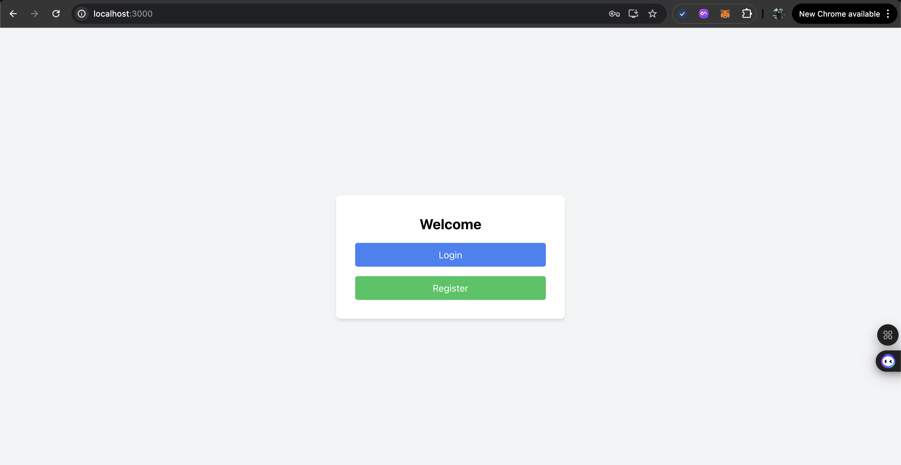
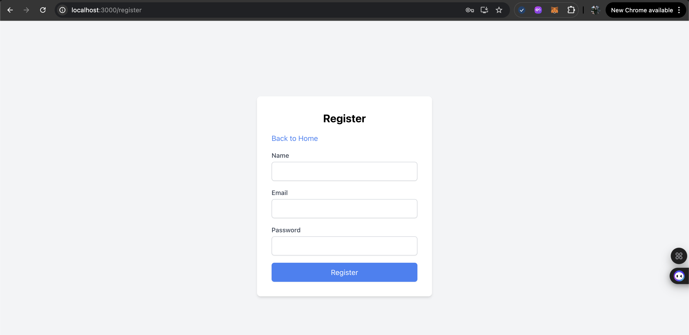
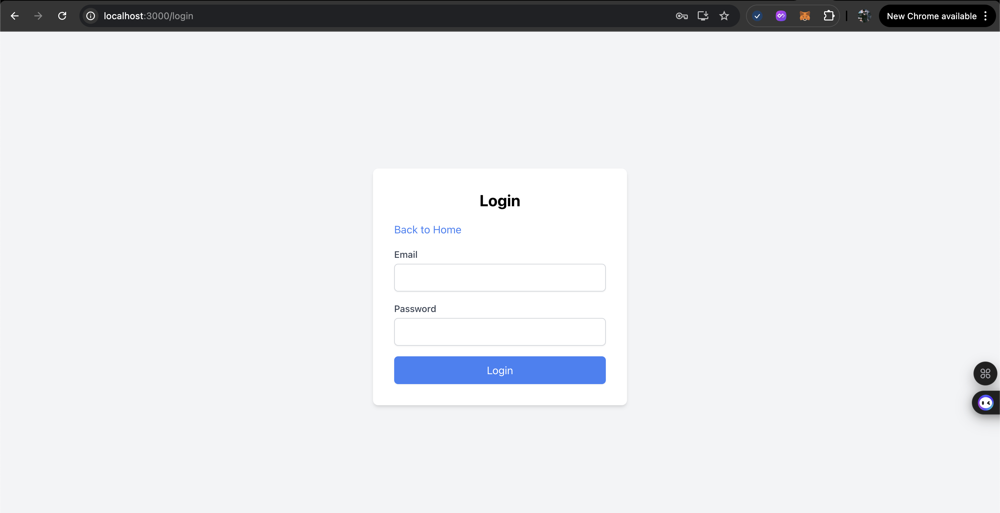
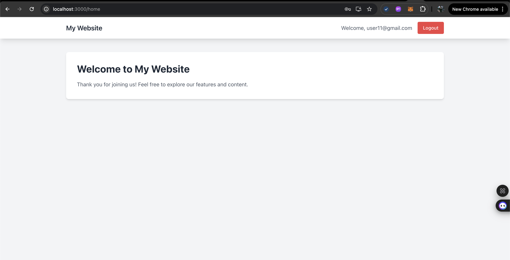

#### Auth form



#### Register form



#### Login form



#### Homepage


Host deploy: http://14.225.210.222:3000/

#### DEPLOY SERVER:

##### SOLUTION 1:

  ```
# Kill any existing process on port 3000
sudo kill $(lsof -t -i:3000)

# Start with nohup
nohup serve -s build -p 3000 > output.log 2>&1 &

# Verify it's running
ps aux | grep serve
  ```

##### SOLUTION 2:

```
pm2 delete all
cd /root/PTUDWNC/auth-form
pm2 start npm --name "react-app" -- start
pm2 save
```